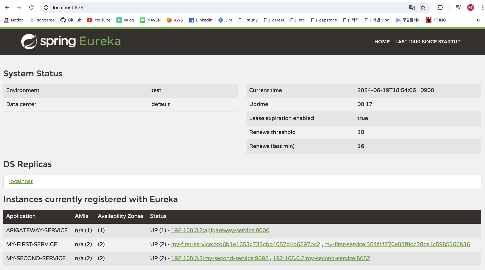
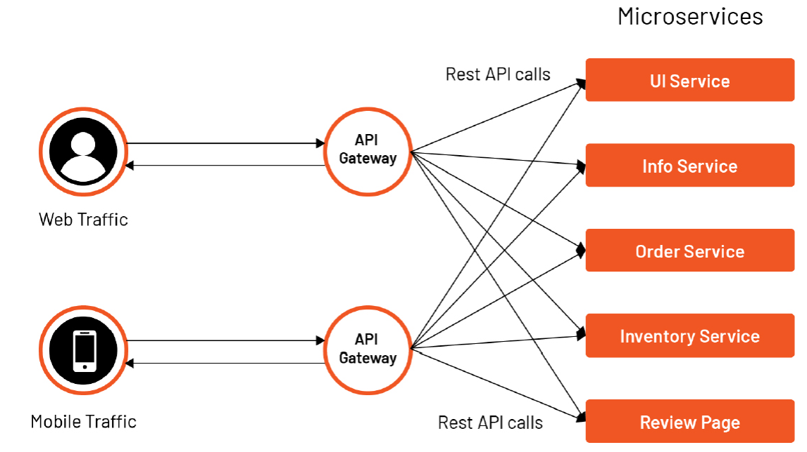
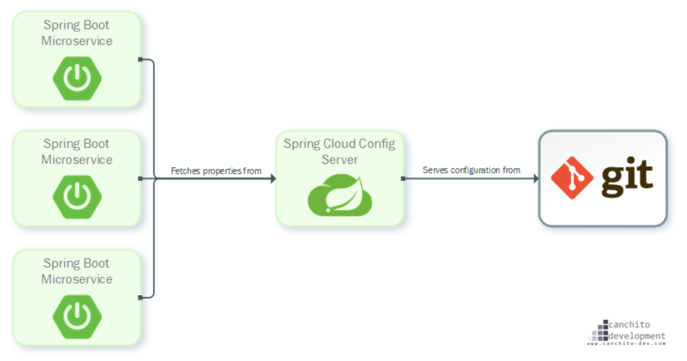
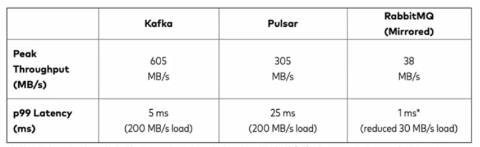
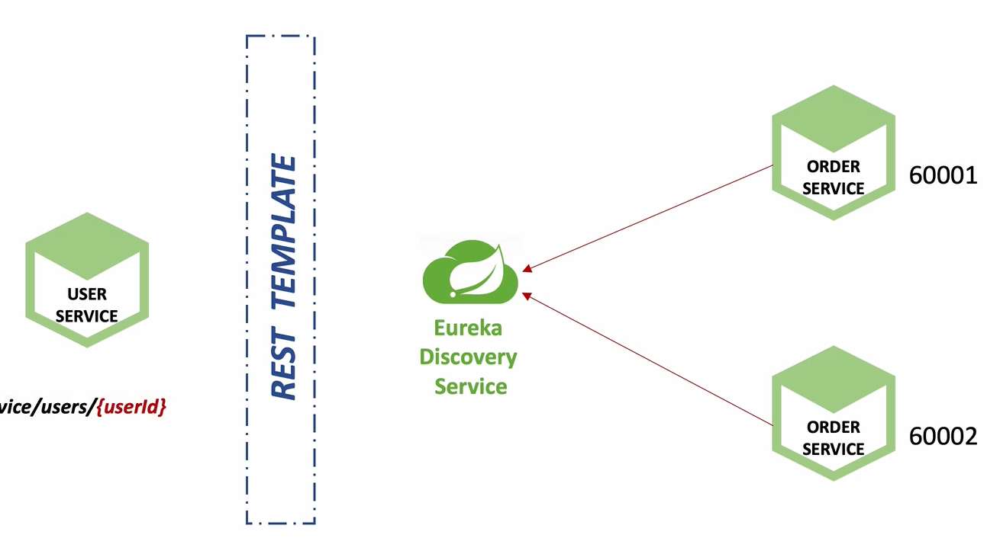
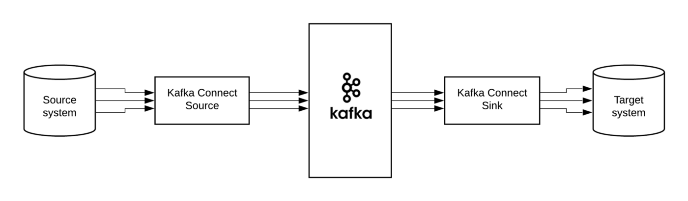
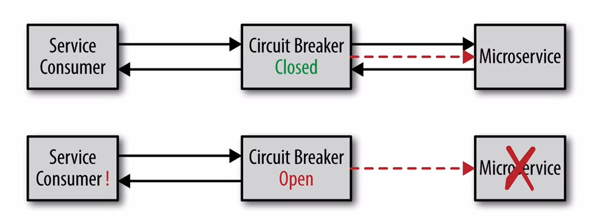
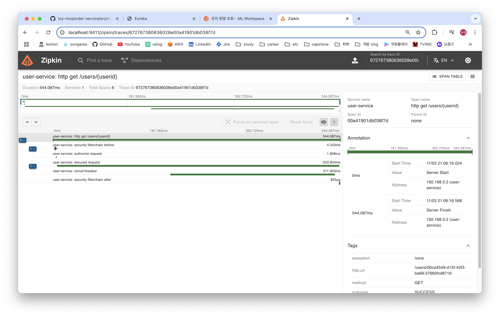

인프런에서 [Spring Cloud로 개발하는 마이크로서비스 애플리케이션 강의](https://www.inflearn.com/course/%EC%8A%A4%ED%94%84%EB%A7%81-%ED%81%B4%EB%9D%BC%EC%9A%B0%EB%93%9C-%EB%A7%88%EC%9D%B4%ED%81%AC%EB%A1%9C%EC%84%9C%EB%B9%84%EC%8A%A4/dashboard)
를 듣고 정리한 내용입니다.

<br/>

## 목차

1. [Spring Cloud Netflix Eureka](#1-spring-cloud-netflix-eureka)
    - [Eureka Server](#11-eureka-server)
2. [API Gateway(Netflix Zuul, Spring Cloud Gateway)](#2-api-gateway-netflix-zuul-spring-cloud-gateway)
    - [API Gateway란?](#21-api-gateway란)
    - [Spring Cloud Zuul](#22-spring-cloud-zuul)
    - [Spring Cloud Gateway](#23-spring-cloud-gateway)
    - [Spring Cloud Gateway Filter](#24-spring-cloud-gateway--filter-적용하기)
    - [Spring Cloud Gateway LoadBalancer](#24-spring-cloud-gateway--loadbalancer)
3. [Spring Cloud Config Server](#3-spring-cloud-config-server)
    - [Spring Cloud Config 적용 방법](#31-spring-cloud-config-적용-방법)
    - [Spring Cloud Config Encrypt/Decrypt](#32-spring-cloud-config-적용-방법)
    - [Config Server의 변경사항을 종료없이 Micro Service에 적용하기](#34-config-server의-변경-값을-micro-service에-적용하기)
4. [Spring Cloud Bus](#4-spring-cloud-bus)
    - [AMQP 설명](#41-amqp-설명)
    - [Spring Cloud Bus 동작](#42-spring-cloud-bus-동작-방식)
    - [Spring Cloud Bus 적용](#43-spring-cloud-bus-적용하기)
5. [설정 정보의 암호화 처리](#5-설정-정보의-암호화-처리-)
    - [암복호화 기본 개념](#51-암호화-기본-개념)
    - [설정파일 암복호화 활성화](#52-설정파일-암복호화-활성화)
6. [MicroService 간 통신](#6-microservice-간-통신)
    - [RestTemplate](#61-resttemplate)
    - [OpenFeign](#62-openfeign)
7. [데이터 동기화를 위한 Apache Kafka 활용](#7-데이터-동기화를-위한-apache-kafka-활용-1)
    - [Apache Kafka 개요](#7-1-apache-kafka-개요)
    - [Apache Kafka 서버 기동 및 튜토리얼](#7-2-apache-kafka-서버-기동-및-튜토리얼)
    - [Kafka Connect 개요 및 기동](#7-3-kafka-connect)
8. [장애 처리와 Microservice 분산 추적](#8-장애-처리와-microservice-분산-추적)
    - [Circuitbreaker & Resilience4j](#8-1-circuitbreaker--resilience4j)
    - [Zipkin을 이용한 Microservice 분산 추적 구현](#8-2-zipkin을-이용한-microservice-분산-추적)

<br/>

# 1. Spring Cloud Netflix Eureka

Spring Cloud Eureka는 서비스 레지스트리와 서비스 디스커버리를 지원하는 라이브러리로써, 마이크로 서비스들의 정보를 저장하며, Server와 Client로 나뉜다.

<br/>

> Service Registry

마이크로서비스 / 관리, 운영을 위한 기반 서비스의 주소와 유동적인 IP를 매핑하여 저장하는 패턴

<br/>

> Service Discovery

클라이언트가 여러 개의 마이크로서비스를 호출하기 위해 최적 경로를 찾아주는 라우팅 기능과 적절한 부하 분산을 위한 로드 밸런싱 기능을 제공하는 패턴

<br/>

## 1.1 Eureka Server

- REST API 기반으로 다양한 언어에서 사용 가능
- 레지스트리의 모든 정보는 모든 Eureka Client에서 복제되어 있으며 가용 중인 모든 서비스들의 목록을 확인할 수 있고 30초마다 목록이 갱신됨
- Eureka Client들에게 자신이 가지고 있는 Eureka Client들의 정보를 공유
- 가용 상태의 서비스 목록 확인 시 서비스의 이름을 기준으로 탐색, 로드 밸런싱을 위해 내부적으로 Ribbon (클라이언트 측의 로드 밸런서) 을 사용

<br/>

### 의존성 추가

```xml

<dependencies>
    <dependency>
        <groupId>org.springframework.cloud</groupId>
        <artifactId>spring-cloud-starter-netflix-eureka-server</artifactId>
    </dependency>
</dependencies>
```

<br/>

### 유레카 서버 활성화
: `@EnableEurekaServer`을 이용해 유레카 서버를 활성화
```java
@EnableEurekaServer
@SpringBootApplication
public class DiscoveryserviceApplication {

    public static void main(String[] args) {
        SpringApplication.run(DiscoveryserviceApplication.class, args);
    }

}

```

<br/>

### 유레카 서버 GUI 활용
: 브라우저에서 `{serverUrl}:{serverPort}` 접속시, 등록된 마이크로 서비스들을 확인 가능



<br/>

## 1.2 Eureka Client
- 서비스 시작 시 Eureka Server에 자신의 정보를 등록
- 등록된 후 30초마다 레지스트리에 핑을 전송하여 자신의 가용 상태를 알림
- 레지스트리로부터 다른 Eureka Client의 서비스 정보를 확인할 수 있음

<br/>

### 의존성 추가
```xml
<dependencies>
    <dependency>
        <groupId>org.springframework.cloud</groupId>
        <artifactId>spring-cloud-starter-netflix-eureka-client</artifactId>
    </dependency>
</dependencies>
```

<br/>

### 유레카 클라이언트 활성화
: `@EnableDiscoveryClient`를 이용해 유레카 클라이언트 활성화
```java
@EnableDiscoveryClient
@SpringBootApplication
public class UserServiceApplication {

    public static void main(String[] args) {
        SpringApplication.run(UserServiceApplication.class, args);
    }

}

```

<br/>

### 유레카에 마이크로 서비스 등록
```yaml
spring:
  application:
    name: user-service         # 마이크로 서비스 이름

eureka:
  client:
    register-with-eureka: true # 유레카에 등록함을 명시
    fetch-registry: true       # 유레카 서버로부터 인스턴스들의 정보를 주기적으로 갱신된 정보를 가져옴
    service-url:
      defaultZone: http://127.0.0.1:8761/eureka # 유레카 서버 주소
```

<br/>

# 2. API Gateway (Netflix Zuul, Spring Cloud Gateway)

## 2.1 API Gateway란?



> API Gateway의 역할

- 인증 및 권한 부여
- 서비스 검색 통합
- 응답 캐싱
- 정책, 회로 차단기 및 QoS 다시 시도
- 속도 제한
- 부하 분산
- 로깅, 추적, 상관관계
- 헤더, 쿼리 문자열 및 청구 변환
- IP 허용 목록에 추가

<br/>

## 2.2 Spring Cloud Zuul

Spring Boot 2.4에서 Maintenance 상태 (현재는 Deprecated)

<br/>

### 의존성 추가

```xml

<dependencies>
    <dependency>
        <groupId>org.springframework.cloud</groupId>
        <artifactId>spring-cloud-starter-netflix-zuul</artifactId>
    </dependency>
</dependencies>
```

<br/>

### Netflix Zuul 활성화
: `@EnableZuulProxy` 를 이용해 활성화
```java
@EnableZuulProxy
@SpringBootApplication
public class ZuulServiceApplication {

    public static void main(String[] args) {
        SpringApplication.run(ZuulServiceApplication.class, args);
    }

}

```

<br/>

### 마이크로 서비스 라우팅 설정
```yaml
spring:
  application:
    name: my-zuul-service

zuul:
  routes:
    first-service:
      path: /first-service/**     # 이 주소로 요청이 들어오면
      url: http://127.0.0.1:8081  # 이 주소로 요청을 보낸다.
    second-service:
      path: /second-service/**
      url: http://127.0.0.1:8082
```

<br/>

## 2.3 Spring Cloud Gateway

### 의존성 추가

```xml

<dependencies>
    <dependency>
        <groupId>org.springframework.cloud</groupId>
        <artifactId>spring-cloud-starter-gateway</artifactId>
    </dependency>
</dependencies>
```

<br/>

### 마이크로 서비스 라우팅 설정

```yaml
eureka:
  client:
    register-with-eureka: false
    fetch-registry: false
    service-url:
      defaultZone: http://localhost:8761/eureka

spring:
  application:
    name: apigateway-service
  cloud:
    gateway:
      routes:
        - id: first-service            # 마이크로 서비스 이름
          uri: http://localhost:8081/  # 마이크로 서비스 주소 (요청을 라우팅할 목적지)
          predicates:
            - Path=/first-service/**   # 라우팅 조건 (경로가 해당될 경우)
        - id: second_service
          uri: http://localhost:8082/
          predicates:
            - Path=/second-service/**
```

<br/>

## 2.4 Spring Cloud Gateway : Filter 적용하기

### 원하는 동작을 하는 필터 코드 작성

```java

@Slf4j
@Component
public class LoggingFilter extends AbstractGatewayFilterFactory<LoggingFilter.Config> {

    public LoggingFilter() {
        super(Config.class);
    }

    @Override
    public GatewayFilter apply(LoggingFilter.Config config) {

        return new OrderedGatewayFilter((exchange, chain) -> {

            ServerHttpRequest request = exchange.getRequest();
            ServerHttpResponse response = exchange.getResponse();

            log.info("Logging Filter baseMessage: {}", config.getBaseMessage());

            if (config.isPreLogger()) {
                log.info("Logging PRE Filter: request id -> [{}]", request.getId());
            }

            return chain.filter(exchange).then(Mono.fromRunnable(() -> {
                if (config.isPostLogger()) {
                    log.info("Logging POST Filter: response code -> [{}]", response.getStatusCode());
                }
            }));
        }, Ordered.HIGHEST_PRECEDENCE);
    }

    @Data
    public static class Config {

        private String baseMessage;
        private boolean preLogger;
        private boolean postLogger;
    }
}
```

<br/>

### 설정 파일에서 필터 적용

```yaml
spring:
  application:
    name: apigateway-service
  cloud:
    gateway:
      default-filters:
        - name: GlobalFilter          # 전역 필터 적용시
          args: # GlobalFilter에서 사용되는 Config의 속성 바인딩
            baseMessage: Spring Cloud Gateway Global Filter
            preLogger: true
            postLogger: true
      routes:
        - id: first-service
          uri: http://localhost:8081/
          filters: # 특정 마이크로 서비스에만 필터 적용시
            - name: CustomFilter
            - name: LoggingFilter
              args: # LoggingFilter에서 사용되는 Config의 속성 바인딩
                baseMessage: Hi, Logging Filter
                preLogger: true
                postLogger: true
```

<br/>

## 2.4 Spring Cloud Gateway : LoadBalancer

Spring Cloud Gateway에는 로드밸런싱 기능이 기본 내장되어있다. (Spring Cloud LoadBalancer 와는 무관)

각 서비스를 주소와 포트번호로 식별하지 않고, 서비스 이름으로만 식별하는 방식으로 **요청을 라운드 로빈 방식으로 분산**시킨다.


<br/>

API Gateway의 환경 설정에서 마이크로 서비스들의 라우팅 정보를 아래와 같이 수정한다.

- AS-IS : **서버 주소와 포트를 명시**
    ```yaml
    spring:
    cloud:
        gateway:
        routes:
            - id: first-service
            uri: http://localhost:8081/   # {서버주소}:{서버포트}
    ```

- TO-BE : **서버의 애플리케이션 이름으로만 명시**
    ```yaml
    spring:
    cloud:
        gateway:
        routes:
            - id: first-service
            uri: lb://MY-FIRST-SERVICE    # {lb=로드밸런싱}:#{서비스이름}
    ```

<br/>

## 2.4 Spring Cloud Gateway : Predicates & Filters

아래에서는 Gateway에서 특정 조건이 만족할 경우, 요청 경로를 수정하는 예제다.

- RemoveRequestHeader=Cookie:
    - 이 필터를 요청에서 Cookie 헤더를 제거
- RewritePath=/user-service/(?<segment>.*), /$\{segment}
    - 이 필터는 요청 경로를 재작성 (ex. `/user-service/login` → `/login`)

- 예시
  ```yaml
  spring:
    application:
      name: apigateway-service
    cloud:
      gateway:
        default-filters:
          - name: GlobalFilter
            args:
              baseMessage: Spring Cloud Gateway Global Filter
              preLogger: true
              postLogger: true
        routes:
          - id: user-service
            uri: lb://USER-SERVICE
            predicates:
              - Path=/user-service/login  # 로그인 요청이 들어올 경우
              - Method=POST
            filters:
              - RemoveRequestHeader=Cookie
              - RewritePath=/user-service/(?<segment>.*), /$\{segment}
  ```

<br/>

# 3. Spring Cloud Config Server



- Config Server는 여러 서비스(MSA) 들의 설정 파일을 외부로 분리해, 하나의 중앙 설정 저장소 처럼 관리 할 수 있도록 해주며, **특정 설정 값이 변경시 각각의 서비스를 재기동 할 필요없이 적용이
  가능하다.**
- 기본적으로 설정 정보 저장을 위해 git을 사용하도록 되어있어서 손쉽게 외부 도구들로 접근 가능하고, 버전 관리도 가능하다. (Git이 아닌, 서버에서 파일로 로컬 보관도 가능하다.)

<br/>

## 3.1 Spring Cloud Config의 장단점

### 장점

1. 여러 서버의 설정 파일을 중앙 서버에서 관리할 수 있다.2. 서버를 재배포 하지 않고 설정 파일의 변경사항을 반영할 수 있다.

<br/>

### 단점

1. Git 서버 또는 설정 서버에 의한 장애가 전파될 수 있다.
2. 우선 순위에 의해 설정 정보가 덮어씌워질 수 있다.
    - 설정 파일의 우선순위는 크게는 아래와 같다.
        1. 프로젝트의 application.yaml
        2. 설정 저장소의 application.yaml
        3. 프로젝트의 application-{profile}.yaml
        4. 설정 저장소의 {application name}/{application name}-{profile}

<br/>

## 3.2 Spring Cloud Config 적용 방법

### 의존성 추가

```xml

<dependency>
    <groupId>org.springframework.cloud</groupId>
    <artifactId>spring-cloud-config-server</artifactId>
</dependency>
```

<br/>

### Config 서버 활성화

```java

@EnableConfigServer
@SpringBootApplication
public class ConfigServerApplication {

    public static void main(String[] args) {
        SpringApplication.run(ConfigServerApplication.class, args);
    }
}
```

<br/>

### Config 서버 설정

```yaml
# Native(Local File System) 사용시
server:
  port: 8888

spring:
  application:
    name: config-service

  profiles:
    active: native # if config server target Native File System (Not Git)

  cloud:
    config:
      server:
        native:
          # http://localhost:8888/ecommerce/native <- check source properties
          search-locations: file://${user.home}/{config-file-path}
          # Native File System Location (Not Git)
  ---------------

# Git 사용시
server:
  port: 8888

spring:
  application:
    name: config-service

  cloud:
    config:
      server:
        git:
          # localhost:8888/ecommerce/default(or dev...) <- check source properties
          # UseCase 1 : Local Git Repository  
          # uri: /Users/2dongyeop/Developments/spring-cloud-config-server

          # UseCase 2 : Remote Public Git Repository
          uri: https://github.com/2dongyeop/spring-cloud-config-server.git

          # UseCase 3 : Remote Private Git Repository (+ UseCase 2)
          #username: $USERNAME
          #password: $PASSWORD
```

<br/>

### Micro Service에서 Config Server 참조하기

Spring Cloud Config Server에 ecommerce.yml이 있다고 가정할 때, 아래와 같이 Config-Server 위치와 파일명을 지정할 수 있다.

```yaml
# bootstrap.yml
# = application.yml보다 먼저 읽히는 설정 파일
spring:
  cloud:
    config:
      uri: http://127.0.0.1:8888
      name: ecommerce # config server에 위치한 yaml 파일 이름
```

<br/>

## 3.3 Spring Cloud Config Encrypt/Decrypt

- Config Server는 속성을 암호화하기 위해 대칭 키와 비대칭 키를 모두
  지원한다. → [참고자료](https://docs.spring.io/spring-cloud-config/reference/server/encryption-and-decryption.html)

<br/>

### 대칭키로 속성 암호화

```yaml
encrypt:
  key: example
```

<br/>

### 비대칭 키로 속성 암호화

RSA나 키스토어를 참조하는 방식을 말하며, 아래에서는 keytool 명령어를 설명한다.
아래 명령어를 실행할 경우, keystore.jks 파일이 생성된다.

```shell
keytool -genkeypair -alias {key-name} -keyalg RSA \
-dname "CN=Web Server, OU=Unit, O=Organization, L=City, S=State, C=US" \
-keypass {password} -keystore keystore.jks -storepass {secret}
```

<br/>

키 스토어를 애플리케이션 루트에 둘 경우, 아래와 같이 키스토어를 사용하도록 구성할 수 있다.

```yaml
encrypt:
  key-store:
    alias: { key-name }
    location: classpath:/keystore.jks
    password: { password }
    secret: { secret }
```

<br/>

위처럼 키 스토어가 준비된 후에는 아래와 같이 속성을 암호화해보자.

```shell
$ curl {config-server-url}:{port}/encrypt -d "plaintext"
-> {cipher-text}
```

이후에는 위에서 암호화한 값들을 속성에 작성하면 된다.

<br/>

## 3.4 Config Server의 변경 값을 Micro Service에 적용하기

### 1. Micro Service를 재부팅하기

- **이 방식은 서비스를 재부팅함으로써 다운타임이 생긴다는 치명적인 단점이 존재.**

<br/>

### 2. Spring Actuator Refresh 기능 이용하기

- Spring Actuator의 Refresh 엔드포인트를 이용하면, 참조하는 환경 설정파일을 새로고침 한다.
- 따라서 API Server를 재시작하지 않고, 변경 사항을 적용할 수 있다.

1. Spring Actuator 의존성 추가하기

```xml

<dependency>
    <groupId>org.springframework.boot</groupId>
    <artifactId>spring-boot-starter-actuator</artifactId>
</dependency>
```

2. application.yml에 endpoint 추가하기

```yaml
management:
  endpoints:
    web:
      exposure:
        include: refresh
```

3. Refresh Endpoint 호출하기
   Actuator의 다른 Endpoint(Health, Info ...)와 달리 POST 방식으로 요청해야 함.

```shell
curl -X POST "{Server Url}:{port}/actuator/refresh"
```

**단, 이 방식은 마이크로 서비스가 수백개가 넘는 등의.. 수많은 설정 파일로 구성된다면 일일이 refresh를 시켜주기에는 무리가 있음.**

<br/>

### 3. Spring Cloud Bus 이용하기

- 분산 시스템의 노드(Micro Service에 해당)를 경량 메시지 브로커(ex. RabbitMQ)와 연결
- 상태 및 구성에 대한 변경 사항을 연결된 노드에게 전달하는 방식
- 자세한 내용은 [4. Spring Cloud Bus](#4-spring-cloud-bus)에서 확인

<br/>

# 4. Spring Cloud Bus

## 4.1 Spring Cloud Bus 동작 방식


- Spring Cloud Bus 로 연결된 서비스들 중 어느 한 곳이라도 `/busrefresh` endpoint를 호출 시, 모든 서비스에 변경 사항이 반영
- 이때, 변경 정보는 AMQP 프로토콜로 전달하는 방식

<br/>

## 4.2 AMQP(Advanced Message Queuing Protocol)

- 메시지 지향 미들웨어를 위한 개방형 표준 응용 계층 프로토콜
    - 큐잉, 라우팅(P2P, Pub-Sub), 신뢰성 및 보안을 강조
    - Erlang, RabbitMQ, Kafka, Apache Pulsar 등이 존재

<br/>

### RabbitMQ와 Kafka 비교

- RabbitMQ
    - 메시지 브로커
    - 초당 20+ 메시지를 소비자에게 전달
    - 메시지 전달 보장, 시스템 간 메시지 전달
    - 브로커, 소비자 중심
- Kafka
    - 분산형 스트리밍 플랫폼, 대용량의 데이터를 처리 가능한 메시징 시스템
    - 초당 100k+ 이상의 이벤트 처리
    - Pub/Sub, Topic에 메시지 전달
    - Ack를 기다리지 않고 전달 가능(성능이 빠름)
    - 생산자 중심
- 성능 비교

  

<br/>

## 4.3 Spring Cloud Bus 적용하기

### RabbitMQ 실행

- 5672 포트 : AMQP 프로토콜로 데이터 전송시 사용
- 15672 포트 : RabbitMQ UI

```bash
$ docker run -it --rm --name rabbitmq -p 5672:5672 -p 15672:15672 rabbitmq:3-management
```

### Config Server

1. 의존성 추가

```xml

<dependency>
    <groupId>org.springframework.boot</groupId>
    <artifactId>spring-boot-starter-actuator</artifactId>
</dependency>
<dependency>
<groupId>org.springframework.cloud</groupId>
<artifactId>spring-cloud-starter-bus-amqp</artifactId>
</dependency>
<dependency>
<groupId>org.springframework.cloud</groupId>
<artifactId>spring-cloud-starter-bootstrap</artifactId>
</dependency>
```

2. RabbitMQ 설정 파일 작성 (busrefresh endpoint 필수)

```yaml
spring:
  ...

  rabbitmq:
    host: 127.0.0.1
    port: 5672 # 5672 is AMQP protocol port. 15672 is RabbitMQ UI port
    username: guest # default value
    password: guest # default value 

management:
  endpoints:
    web:
      exposure:
        include: health, busrefresh
```

### 기타 MicroService 및 API Gateway

1. 의존성 추가(액츄에이터가 이미 추가되어 있다는 가정)

```xml

<dependency>
    <groupId>org.springframework.cloud</groupId>
    <artifactId>spring-cloud-starter-bus-amqp</artifactId>
</dependency>
```

2. RabbitMQ 설정 파일 작성

```yaml
spring:
  ...

  rabbitmq:
    host: 127.0.0.1
    port: 5672 # 5672 is AMQP protocol port. 15672 is RabbitMQ UI port
    username: guest # default value
    password: guest # default value

management:
  endpoints:
    web:
      exposure:
        include: refresh, health, beans, busrefresh
```

### Bus Refresh 동작 호출

RabbitMQ로 Bus refresh를 동작하도록 추가했다면, 어느 Micro Service를 호출해도 상관없다.

```bash
# 아래의 localhost:8000 은 API Gateway 주소입니다.
# API Gateway의 Bus Refresh 호출 시
curl -X POST http://localhost:8000/actuator/refresh

# User Service의 Bus Refresh 호출 시
curl -X POST http://localhost:8000/user-service/actuator/refresh
```

<br/>

# 5. 설정 정보의 암호화 처리

## 5.1 암호화 기본 개념

> Symmetric Encryption(Shared)

- 대칭 암호화 방식
- 암호화/복호화 할 때의 키가 동일

> Asymmetric Encryption(RSA Keypair)

- 암호화/복호화 할 때의 키가 다름
- Private/Public Key 방식
- 혹은 Using Java Keytool(JDK 내장 도구로, private/public 키를 생성)

> 동작 방식

- Spring Cloud Server에서는 `{cipher}` 꼴로 시작하는 암호화된 환경 설정 파일을 저장
- 이후, 이를 참조하는 각각의 Micro Service 들에게는 복호화된 설정 파일을 제공하는 방식
  

<br/>

## 5.2 설정파일 암복호화 활성화

### 1. jks 파일 생성하기

```bash
$ keytool -genkeypair -alias 2dongyeop \
  -keyalg RSA -dname "CN=Dongyeop Lee, OU=Development, O=songareeit.com, L=Seoul, C=KR" \
  -keypass "example1234" -keystore 2dongyeop.jks -storepass "example1234"
```

- `keytool` : Java의 keytool 유틸리티 실행 명령어
- `-genkeypair` : 공개키와 개인키를 생성하는 옵션
- `-alias` : 키의 별칭 지정
- `keyalg RSA` : RSA 알고리즘으로 키 쌍을 생성
- `-dname` : 인증서에 포함될 사용자 정보를 지정
    - `CN (Common Name), OU(Organizational Unit), O(Organization), L(Location), C(Country)`
- `-keypass` : 개인키 암호 지정
- `-keystore` : 키스토어 파일의 경로와 이름을 지정
- `-storepasss` : 키스토어 파일 자체의 암호를 지정
- `-validity` : 인증 기한 설정. 일(day) 단위이며, 기본 값은 90일.

### 2. 키파일 위치 지정

```yaml
# Config Server 설정파일
encrypt:
  # 단방향 암호화. keytool을 이용한 .jks 파일 필요 x
  # key: abcdefghijklmnopqrstuvwxyz0123456789
  key-store:
    location: file://${user.home}/{경로}/{키 이름}.jks
    password: example1234
    alias: 2dongyeop
```

### 3. 암복호화 결과 확인

```bash
$ curl localhost:8888/encrypt -s -d test

-> ASFAVIDSJVSDKDVS....
```

### 4. 암호화된 값을 설정파일에 적용

```yaml
# AS-IS
spring:
  datasource:
    url: jdbc:h2:tcp://localhost/~/testdb
    username: sa
    password:
    driver-class-name: org.h2.Driver
#############################################
# TO-BE
spring:
  datasource:
    url: jdbc:h2:tcp://localhost/~/testdb
    username: '{cipher}AQBd5MeVwOVNJ......'
    password:
    driver-class-name: org.h2.Driver
```

<br/>

# 6. MicroService 간 통신

## 6.1 RestTemplate



### 1. RestTemplate 소개

- 스프링 프레임워크에서 제공하는 RESTful API 통신을 위한 도구
    - 다양한 HTTP Method를 사용하며, 외부 서버와 동기식 방식으로 통신한다.
    - 동기식 으로 요청을 보내고 응답을 받을 때까지 블로킹된다. (응답을 기다린다.)
- Spring 공식 문서에서 RestTemplate을 확인하면 아래와 같이 내용이 있다.
    - 동기식 HTTP 접근에 사용하고 있을 경우 → Spring 6.1에 나온 RestClient 사용을 권장
    - 비동기 및 스트리밍 시나리오의 경우 → WebClient 사용을 권장

### 2. RestTemplate 빈 등록 방식

```java

@Configuration
public class RestTemplateConfig {

    @Value("${restTemplate.connectTimeOut}")
    private Long connectTimeOut;
    @Value("${restTemplate.readTimeOut}")
    private Long readTimeOut;

    @Bean
    @Qualifier("restTemplate")
    public RestTemplate restTemplate(final RestTemplateBuilder restTemplateBuilder) {
        return restTemplateBuilder
                .setConnectTimeout(Duration.ofSeconds(connectTimeOut)) // 외부 API 서버에 연결 요청 시간
                .setReadTimeout(Duration.ofSeconds(readTimeOut))       // 외부 API 서버로부터 데이터를 읽어오는 시간
                .build();
    }
}
```

### 3. RestTemplate 단점

- 비즈니스 코드에 지저분한 설정들이 섞인다.
- Retry를 구현할 경우, 추가 의존성(spring-retry, spring-boot-starter-aop)을 필요로 한다.
- 제공되는 로그가 자세하지 않다.

<br/>

## 6.2 OpenFeign

### 1. OpenFeign 소개

- Netflix에 의해 처음 만들어진 Declarative(선언적) HTTP Client 도구로써, 외부 API 호출을 쉽게 할 수 있도록 도와준다.
- 여기서 선언적이란 애너테이션 사용을 의미한다.

### 2. OpenFeign 장점

- 인터페이스와 애너테이션 기반으로 작성할 코드가 줄어듬
- 익숙한 Spring MVC 애너테이션으로 개발이 가능
- 다른 Spring Cloud 기술들 (Eureka, Circuit Breaker, LoadBalancer) 과의 통합이 쉬움

### 3. OpenFeign 기능

- 타임아웃, 재시도(Retry) 지원
- 각각의 Feign Client별로 로그 레벨을 지정 가능
- Fallback 설정 가능
- Fallback : 실행을 실패(Exception)하는 경우에 대신 실행되게하는 프로세스
- Error Handling (Error Decoder) 지원
- RequestInterceptor 지원
- 위 기능들을 모두 구성 속성(application.yml)로 설정 가능

### 4. 사용 방법

1. 의존성 추가

```xml

<dependency>
    <groupId>org.springframework.cloud</groupId>
    <artifactId>spring-cloud-starter-openfeign</artifactId>
    <version>{version}</version>
</dependency>
```

2. Fegin Client 활성화

```java

@EnableFeignClients // Feign Client 활성화
@SpringBootApplication
public class RequestServerApplication { ...
}
```

3. Feign Client 정의

```java

@FeignClient(value = "order-service", url = "${url.order-service.endpoint")
public interface OrderServiceClient {

    @PostMapping(consumes = MediaType.APPLICATION_JSON_VALUE, produces = MediaType.APPLICATION_JSON_VALUE)
    CommonResponse send(@RequestBody CommonRequest request);
}
```

4. Feign Client 호출

```java

@Slf4j
@Service
@RequiredArgsConstructor
public class UserService {

    private final OrderFeignClient orderFeignClient;

    /**
     * FeignClient로 외부 API를 호출하는 예시
     */
    public CommonResponse send(final CommonRequest request) {
        log.debug("request[{}]", request);
        return orderFeignClient.send(request);
    }
}

```

5. 기타 - 로그 설정 및 에러 처리

```java

@Slf4j
public class CustomErrorDecoder implements ErrorDecoder {

    @Override
    public Exception decode(final String methodKey, final Response response) {
        log.warn("statusCode[{}], methodKey[{}]", response.status(), methodKey);

        return switch (response.status()) {
            case 400 -> ...
            case 404 -> ...
            case 500 -> ...
            default -> ...
        };
    }
}
``` 

<br/>

# 7. 데이터 동기화를 위한 Apache Kafka 활용-1

## 7-1. Apache Kafka 개요

### 1. Apache Kafka 소개

- Apache Software Foundation의 Scalar 언어로 된 오픈소스 메시지 브로커
- 링크드인에서 개발 (2011년 오픈소스화). 이후 엔지니어들이 Kafka 개발에 집중하기 위해 Confluent 창립

### 2. Apache Kafka 특징

- Producer/Consumer 분리
- 메시지를 여러 Consumer에게 허용
- 높은 처리량을 위한 메시지 최적화
- Scale-out 가능, Eco-system

### 3. Apache Kafka 구성

- 실행된 Kafka 애플리케이션 서버
- 3대 이상의 Broker Cluster 구성
    - n대 중 1개는 Controller 역할
    - = 각 Broker에게 담당 파티션 할당 수행 & Broker 정상 동작 모니터링
- Zookeeper 연동
    - 메타데이터 (Broker ID, Controller ID 등) 저장

### 4. Apache Kafka 설치

- Docker 를 이용해서도 환경 구성은 가능. 강의에서는 직접 설치하는 방식
- [공식 홈페이지 설치 링크](https://kafka.apache.org/downloads)

## 7-2. Apache Kafka 서버 기동 및 튜토리얼

> 아래 모든 명령어를 실행시키는 위치는 Kafka를 다운로드한 위치(`$KAFKA_HOME`)입니다.

### 1. Zookeeper 및 Kafka 서버 기동

```shell
# Zookeeper 실행
$ ./bin/zookeeper-server-start.sh ./config/zookeeper.properties

# Kafka 실행
$ ./bin/kafka-server-start.sh ./config/server.properties
```

### 2. Topic 생성 및 목록 확인

```shell
# 토픽 생성
$ ./bin/kafka-topics.sh --bootstrap-server localhost:9092 --create --topic quickstart-events --partitions 1

# 토픽 목록 확인
$ ./bin/kafka-topics.sh --bootstrap-server localhost:9092 --list

# 특정 토픽 상세 조회
$ ./bin/kafka-topics.sh --bootstrap-server localhost:9092 --describe --topic quickstart-events
```

### 3. Producer 및 Consumer 실행

```shell
# Producer 실행
$ ./bin/kafka-console-producer.sh --broker-list localhost:9092 --topic quickstart-events
> {전달할 메시지 입력}

# Consumer 실행
$ ./bin/kafka-console-consumer.sh --bootstrap-server localhost:9092 --topic quickstart-events --from-beginning
{시작 직후 즉시 메시지 도착 & 이전에 해당 토픽으로 도착한 메시지가 있다면 즉시 노출.}
```

## 7-3. Kafka Connect



### 1. Kafka Connect 소개

- Data를 Import/Export 하는 기능 제공
- 코드를 작성하지 않고 Configuration으로 데이터를 이동
- Standalone mode & Distribution mode 지원
    - RESTful API 통해 지원
    - Stream 또는 Batch 형태로 데이터 전송 가능
    - 커스텀 Connector를 통한 다양한 Plugin 제공(File, S3, Hibe, Mysql, etc ...)

### 2. Kafka Connect 설치 및 설정

#### Kafka Connect 설치

```shell
$ curl -O https://packages.confluent.io/archive/7.7/confluent-community-7.7.1.tar.gz
$ tar xvf confluent-community-7.1.1.tar.gz
```

#### JDBC Connector 설치

- [JDBC Connector 설치 링크](https://www.confluent.io/hub/confluentinc/kafka-connect-jdbc?session_ref=https://www.google.com/&_ga=2.258331402.1052886943.1729079800-1664852375.1729079799&_gl=1*se5yq4*_gcl_au*MTQxNTg1NzI5OC4xNzI5MDc5Nzk5*_ga*MTY2NDg1MjM3NS4xNzI5MDc5Nzk5*_ga_D2D3EGKSGD*MTcyOTA3OTc5OS4xLjEuMTcyOTA4MTM5OS41OS4wLjA.)

#### JDBC Connector를 플러그인으로 추가

```shell
# confluent-7.1.1 설치 위치에서
$ code ./etc/kafka/connect-distributed.properties
>>>>>
 plugin.path=/Users/2dongyeop/Developments/kafka-demo/confluentinc-kafka-connect-jdbc-10.8.0/lib
<<<<< EOF
```

#### JDBC Connector에서 사용할 MySQL Driver 복사

```shell
# Order Service에 mariadb-java-client 의존성을 추가했다면 로컬 mvn repository에 jar이 존재.
cp /Users/2dongyeop/.m2/repository/org/mariadb/jdbc/mariadb-java-client/2.7.2/mariadb-java-client-2.7.2.jar \
   /Users/2dongyeop/Developments/kafka-demo/confluent-7.1.1/share/java/kafka
```

### 3. Kafka Source/Sink Connector 실행

#### Kafka Connect 실행

```shell
# Connect가 설치된 위치에서
$ ./bin/connect-distributed ./etc/kafka/connect-distributed.properties
```

#### Kafka Source Connect 추가

```shell
POST localhost:8083/connectors # Connector 주소
BODY
{
    "name": "my-source-connect",
    "config": {
        "connector.class": "io.confluent.connect.jdbc.JdbcSourceConnector",
        "connection.url": "jdbc:mysql://localhost:3306/mydb?useSSL=false&serverTimezone=Asia/Seoul&autoReconnect=true&useUnicode=yes&characterEncoding=UTF-8&allowPublicKeyRetrieval=true",
        "connection.user": "root",
        "connection.password": "test1234",
        "mode": "incrementing",
        "incrementing.column.name": "id",
        "table.whitelist": "users",
        "topic.prefix": "my_topic_",
        "tasks.max": "1"
    }
}
```

#### Kafka Source Connect 조회

```shell
# 목록 조회
curl localhost:8083/connectors

# 상세 조회
curl localhost:8083/connectors/my-source-connect
```

#### Kafka Source Connect 동작 확인

1. Consumer 기동

```shell
./bin/kafka-console-consumer.sh --bootstrap-server localhost:9092 --topic my-source-connect --from-beginning
```

2. MySQL 접속 후 데이터 삽입

```sql
insert into users(user_id, pwd, name)
values ('user1', 'test1111', 'username');
```

3. Consumer 로그 확인

```text
{"schema":{"type":"struct","fields":[{"type":"int32","optional":false,"field":"id"},{"type":"string","optional":true,"field":"user_id"},{"type":"string","optional":true,"field":"pwd"},{"type":"string","optional":true,"field":"name"},{"type":"int64","optional":true,"name":"org.apache.kafka.connect.data.Timestamp","version":1,"field":"created_at"}],"optional":false,"name":"users"},"payload":{"id":1,"user_id":"user1","pwd":"test1111","name":"username","created_at":1729631568000}}
```

#### Kafka Sink Connect 추가

- 등록과 동시에 DB에 `my_topic_users` 테이블이 생성되며,
- `user` 테이블에서 변경사항이 생길 경우 `my_topic_users` 테이블에 함께 적용됨.
    - → 이러한 점을 토대로 데이터를 옮기는 ETL 용도로 사용 가능.

```shell
POST localhost:8083/connectors # Connector 주소
BODY
{
    "name": "my-sink-connect",
    "config": {
        "connector.class": "io.confluent.connect.jdbc.JdbcSinkConnector",
        "connection.url": "jdbc:mysql://localhost:3306/mydb?useSSL=false&serverTimezone=Asia/Seoul&autoReconnect=true&useUnicode=yes&characterEncoding=UTF-8&allowPublicKeyRetrieval=true",
        "connection.user": "root",
        "connection.password": "test1234",
        "auto.create": "true",
        "auto.evolve": "true",
        "delete.enabled": "false",
        "tasks.max": "1",
        "topics": "my_topic_users"
    }
}
```

### 4. Kafka를 이용한 데이터 동기화 구성

- 사전 배경 : 아래와 같이 구성한 뒤, kafka & zookeeper 서버를 기동한 상태
- 동작 확인 : 주문을 생성할 경우, Catalog의 Stock이 감소하는지 확인

#### Kafka Consumer 구성

1. 의존성 추가
    ```xml
    <dependency>
        <groupId>org.springframework.kafka</groupId>
        <artifactId>spring-kafka</artifactId>
    </dependency>
    ```

2. KafkaConsumerConfig 작성

  ```java

@EnableKafka
@Configuration
public class KafkaConsumerConfig {

    @Value("${kafka.server.ip:localhost:9092}")
    private String kafkaServerIp;

    @Bean
    public ConsumerFactory<String, String> consumerFactory() {
        final HashMap<String, Object> properties = new HashMap<>();
        properties.put(ConsumerConfig.BOOTSTRAP_SERVERS_CONFIG, kafkaServerIp);
        // 다수의 Consumer 가 존재할 경우, 특정 그룹만이 소비하도록 할 수 있음.
        // 현재처럼 1개의 Consumer 만 존재할 경우에는 아무 소용x
        properties.put(ConsumerConfig.GROUP_ID_CONFIG, "consumerGroupId");
        properties.put(ConsumerConfig.KEY_DESERIALIZER_CLASS_CONFIG, StringDeserializer.class);
        properties.put(ConsumerConfig.VALUE_DESERIALIZER_CLASS_CONFIG, StringDeserializer.class);

        return new DefaultKafkaConsumerFactory<>(properties);
    }

    @Bean
    public ConcurrentKafkaListenerContainerFactory<String, String> kafkaListenerContainerFactory() {
        final ConcurrentKafkaListenerContainerFactory<String, String> kafkaListenerContainerFactory = new ConcurrentKafkaListenerContainerFactory<>();
        kafkaListenerContainerFactory.setConsumerFactory(consumerFactory());

        return kafkaListenerContainerFactory;
    }
}
  ```

3. KafkaConsumer 작성
    ```java
    @Slf4j
    @Service
    @RequiredArgsConstructor
    public class KafkaConsumer {
    
        private final CatalogRepository catalogRepository;
    
        @KafkaListener(topics = "example-catalog-topic")
        public void updateQty(final String kafkaMessage) {
            log.info("kafkaMessage[{}]", kafkaMessage);
    
            final ObjectMapper mapper = new ObjectMapper();
            HashMap<Object, Object> map = new HashMap<>();
    
            try {
                map = mapper.readValue(kafkaMessage, new TypeReference<>() {
                });
            } catch (JsonProcessingException jsonProcessingException) {
                log.error("", jsonProcessingException);
            }
    
            /* 비즈니스 로직.. */
            final CatalogEntity catalog = catalogRepository.findByProductId(map.get("productId").toString());
            log.info("catalog[{}]", catalog);
    
            if (catalog != null) {
                catalog.setStock(catalog.getStock() - (Integer) map.get("qty"));
                catalogRepository.save(catalog);
            }
        }
    }
    ```

#### Kafka Producer 구성

1. 의존성 추가
    ```xml
    <dependency>
        <groupId>org.springframework.kafka</groupId>
        <artifactId>spring-kafka</artifactId>
    </dependency>
    ```

2. KafkaProducerConfig 작성
    ```java
    @EnableKafka
    @Configuration
    public class KafkaProducerConfig {
    
        @Value("${kafka.server.ip:localhost:9092}")
        private String kafkaServerIp;
    
        @Bean
        public ProducerFactory<String, String> producerFactory() {
            final HashMap<String, Object> properties = new HashMap<>();
            properties.put(ProducerConfig.BOOTSTRAP_SERVERS_CONFIG, kafkaServerIp);
            properties.put(ProducerConfig.KEY_SERIALIZER_CLASS_CONFIG, StringSerializer.class);
            properties.put(ProducerConfig.VALUE_SERIALIZER_CLASS_CONFIG, StringSerializer.class);
    
            return new DefaultKafkaProducerFactory<>(properties);
        }
    
        @Bean
        public KafkaTemplate<String, String> kafkaTemplate() {
            return new KafkaTemplate<>(producerFactory());
        }
    }
    ```


3. KafkaProducer 작성
    ```java
    @Slf4j
    @Service
    @RequiredArgsConstructor
    public class KafkaProducer {
    
        private final KafkaTemplate<String, String> kafkaTemplate;
    
        public OrderDto send(String topic, OrderDto orderDto) {
    
            final ObjectMapper mapper = new ObjectMapper();
            String json = "";
    
            try {
                json = mapper.writeValueAsString(orderDto);
            } catch (JsonProcessingException e) {
                log.error("", e);
            }
    
            kafkaTemplate.send(topic, json);
            log.info("[Kafka] to Order microService : {}", orderDto);
    
            return orderDto;
        }
    }
    ```

<br/>

# 8. 장애 처리와 Microservice 분산 추적

## 8-1. CircuitBreaker & Resilience4J



### 1. CircuitBreaker 소개

- 장애가 발생하는 서비스에 반복적인 호출을 하지 않도록 차단하는 역할
- 특정 서비스가 정상적으로 동작하지 않을 경우, 다른 기능으로 대체 수행
    - → 장애 회피

### 2. CircuitBreaker 적용하기

> AS-IS (Spring Boot 2.3 & Spring Cloud 2020 이전)

1. 의존성 추가

      ```xml
    <dependency>
        <groupId>org.springframework.cloyd</groupId>
        <artifactId>spring-cloud-starter-netflix-hystrix</artifactId>
    </dependency> 
      ```

2. 활성화 애너테이션 지정
    ```java
    @EnableCircuitBreaker
    public class Application {...}
    ```

3. 활성화 환경설정 지정
    ```yaml
    feign:
      hystrix:
        enabled: true
    ```

<br/>

> TO-BE (Spring Cloud 2020 이후)

- `netflix-hystrix` 가 지원이 종료되어, `Resilience4j` 를 사용
- 아래 내용 참고

<br/>

### 3. Resilience4j 소개

- Netflix Hystrix 로부터 영감받은 경량 라이브러리 ([출처](https://resilience4j.readme.io/))
- Fault Tolerance : 에러가 발생해도 정상 서비스 운영이 가능한 성격
- 내부 기능
    - resilience4j-circuitbreaker
    - resilience4j-ratelimiter
    - resilience4j-bulkhead
    - resilience4j-retry (sync and async)
    - resilience4j-timelimiter
    - resilience4j-cache (Result caching)

<br/>

### 4. Resilience4j 적용하기

> Default Configuration 이용 시

1. 의존성 추가
    ```xml
    <dependency>
        <groupId>org.springframework.cloud</groupId>
        <artifactId>spring-cloud-starter-circuitbreaker-resilience4j</artifactId>
    </dependency>
    ```

2. 코드 작성
    ```java
    @Autowired
    private CircuitBreakerFactory circuitBreakerFactory;
    
    ...
    
    CircuitBreaker circuitBreaker = circuitBreakerFactory.create("circuitbreaker");
    List<ResponseOrder> ordersList = circuitBreaker.run(() -> orderServiceClient.getOrders(userId),
            throwable -> new ArrayList<>());
    ```

<br/> 

> Custom Configuration 이용 시

1. 설정 클래스 작성
   ```java
    @Configuration
    public class Resilience4jConfiguration {
        @Bean
        public Customizer<Resilience4JCircuitBreakerFactory> globalCustomCircuitBreakerFactory() {
            /*
             * failureRateThreshold() : CircuitBreaker를 활성화(open) 할 지를 결정하는 실패 비율. 기본 50
             * waitDurationInOpenState() : CircuitBreaker 활성화 상태를 유지하는 지속 시간. 기본값 60s
             * slidingWindowType() 
                - CircuitBreaker가 비활성화(closed)될 때 통화 결과를 기록하는 데에 사용되는 슬라이딩 창의 유형
                - 카운트 기반/시간 기반 
             * slidingWindowSize() 
                - CircuitBreaker가 비활성화(closed)될 때 호출 결과를 기록하는 데에 사용되는 슬라이딩 창의 크기 구성
                - 기본값 100
             */
            final CircuitBreakerConfig circuitBreakerConfig = CircuitBreakerConfig.custom()
                    .failureRateThreshold(50) 
                    .waitDurationInOpenState(Duration.ofMillis(60000))
                    .slidingWindowType(CircuitBreakerConfig.SlidingWindowType.COUNT_BASED)
                    .slidingWindowSize(100)
                    .build();
   
            /* 
             * TimeLimiter : n초 동안의 응답이 없을 경우, 에러로 간주
             * default : 1초 
             */
            final TimeLimiterConfig timeLimiterConfig = TimeLimiterConfig.custom()
                    .timeoutDuration(Duration.ofSeconds(1))
                    .build();

            return factory -> factory.configureDefault(id -> new Resilience4JConfigBuilder(id)
                    .timeLimiterConfig(timeLimiterConfig)
                    .circuitBreakerConfig(circuitBreakerConfig)
                    .build());
        }
    }
    ```

<br/>

## 8-2. Zipkin을 이용한 Microservice 분산 추적

### 1. [Zipkin](https://zipkin.io/) 소개

- Twitter에서 사용하는 분산 환경의 Timing 데이터 수집, 추적 오픈소스
- 분산환경에서의 시스템 병목 현상 파악
- Collector, Query Service(API), Database(Storage), Web UI로 구성

<br/>

> Span과 Trace
> - Span : 하나의 요청에서 사용되는 작업의 단위
> - Trace : 하나의 요청에 대한 같은 Trace ID 발급(트리 구조로 이루어진 Span 셋)

<br/> 

### 2. ~~Spring Cloud Sleuth~~ Micrometer-Tracing

- **Spring Boot 3.x 부터는 Sleuth가 Deprecated되어 Micrometer-tracing을 사용해야 함.**
- 스프링부트 애플리케이션을 Zipkin과 연동
- 요청 값에 따른 Trace ID, Span ID를 부여

<br/>

### 3. Zipkin 분산 추적 구성

1. Zipkin 기동

```shell
# Docker 이용시 (설치하여 사용하는 방식은 생략.)
$ docker run -d -p 9411:9411 openzipkin/zipkin
```

2. Zipkin 및 Micrometer Tracing 의존성 추가

```xml
<!-- Micrometer Tracing으로 MSA 분산 추적 구현 -->
<dependency>
    <groupId>io.micrometer</groupId>
    <artifactId>micrometer-tracing-bridge-brave</artifactId>
</dependency>

        <!-- 분산 추적 내용을 zipkin으로 모니터링 -->
<dependency>
<groupId>io.zipkin.reporter2</groupId>
<artifactId>zipkin-reporter-brave</artifactId>
</dependency>
``` 

3. 설정파일에 zipkin 주소 및 샘플링 설정 추가

```yaml
 management:
   tracing:
     sampling:
       probability: 1.0   # 로그 샘플링 비율 - 1.0일 경우에는 100% 로그를 샘플링, default : 0.1
     propagation: # 추적 정보 전파 방식 (wbc, b3, b3_multi)
       produce: b3_multi  # 추적 정보를 여러 개의 헤더로 나누어 전송
       consume: b3        # HTTP 헤더를 사용하여 추적 ID, 스팬 ID 등을 전달

   zipkin:
     tracing:
       endpoint: "http://localhost:9411/api/v2/spans"

 logging:
   pattern:
     level: "%5p [%X{traceId:-},%X{spanId:-}]"
```

4. Zipkin UI에서 요청 추적

- 우측 검색 창에 Trace ID 입력 시, 확인 가능
  

<br/>
